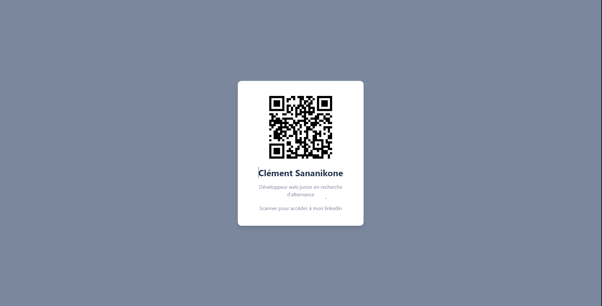

# Welcome to qr-code 👋


> Simple QR-Code in a container linking to my linkedin account.

preview: 

## Install

```sh
npm install
```

## Usage

```sh
vite
```

## Author

👤 **Clément Sananikone**

* Github: [@AgurSan](https://github.com/AgurSan)

## Show your support

Give a ⭐️ if this project helped you!


***
_This README was generated with ❤️ by [readme-md-generator](https://github.com/kefranabg/readme-md-generator)_
